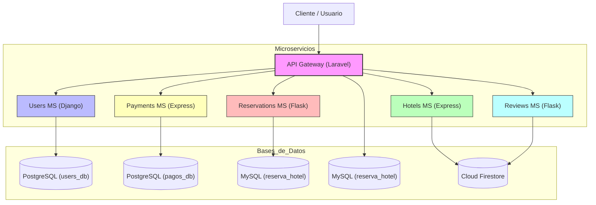

# Diagrama de Arquitectura - Sistema de Reserva de Hoteles

Este diagrama ilustra la arquitectura de microservicios, el API Gateway como único punto de entrada y los diversos sistemas de bases de datos utilizados en los servicios.

## Flujo de Comunicación
1. **Petición**: Todas las peticiones externas llegan al API Gateway construido en Laravel.
2. **Autenticación**: El Gateway utiliza Sanctum y se comunica con el microservicio de Usuarios (Django) para validar credenciales.
3. **Proxy**: Las peticiones validadas se redirigen al microservicio correspondiente según la ruta de la URL.
4. **Gestión de Datos**: Cada microservicio gestiona su propia base de datos, siguiendo estrictamente el patrón de una base de datos por servicio.
